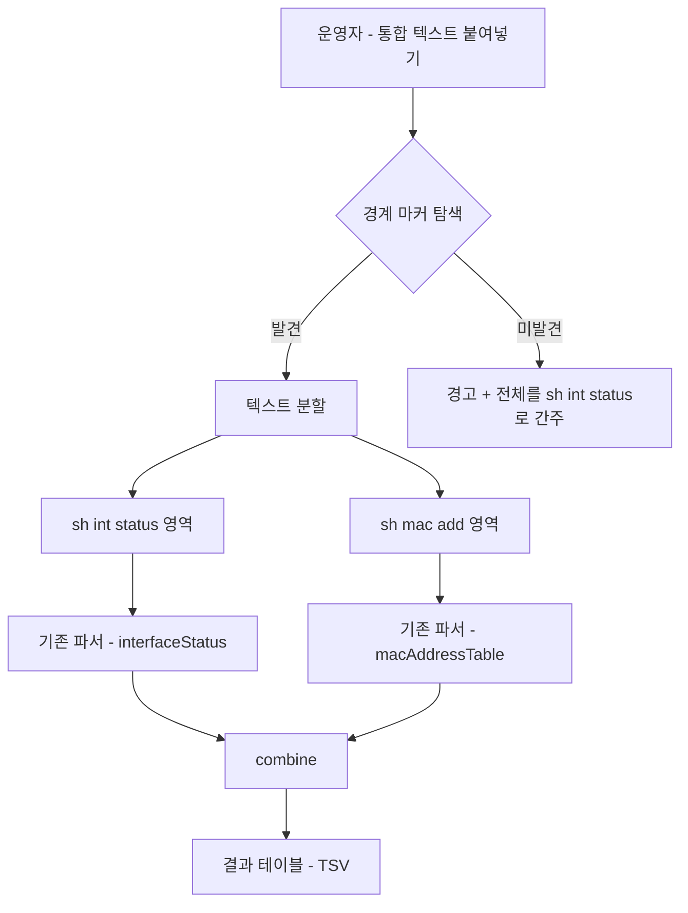
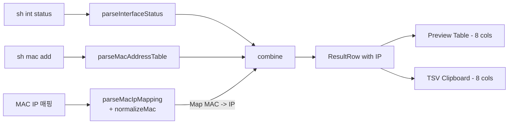
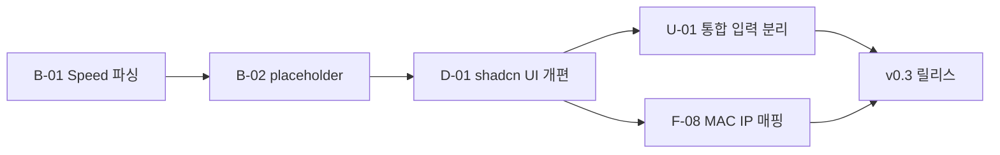

# cleanMac 개선 및 추가 개발 계획 (v0.3)

<i class="fa-solid fa-clipboard-check"></i> 본 문서는 v0.2 출시 후 현장 사용 중 식별된 **2건의 복사 정확성 버그**, **1건의 UX 불편**, **1건의 신규 기능 요구**를 분석하고, 버전 0.3 작업 범위와 PR 분리 전략을 제안한다.

> 본 문서는 **설계 단계** 산출물이다. 코드 변경은 후속 PR에서 진행하며, 본 문서가 합의된 시점에 requirements.md를 v0.3으로 갱신한다.

---

## 1. 변경 요약 (Executive Summary)

| 분류 | ID | 항목 | 우선순위 | 영향 범위 |
|------|----|------|---------|----------|
| <i class="fa-solid fa-bug"></i> Bug | B-01 | `Speed` 컬럼 값(`a-1000`)에 탭이 끼어 Excel에서 2개 셀로 분할 | <i class="fa-solid fa-fire"></i> 긴급 | `interfaceStatus.ts` |
| <i class="fa-solid fa-bug"></i> Bug | B-02 | 멀티 MAC 연속 행이 Excel에서 잘못된 컬럼(2번째)에 붙음 | <i class="fa-solid fa-fire"></i> 긴급 | `combine.ts`, `App.tsx` |
| <i class="fa-solid fa-palette"></i> Design | D-01 | Tailwind 기반 **shadcn/ui** 도입 + 컴포넌트·레이아웃 개편 | 권장 | UI 전반 (`App.tsx`, 신규 `components/`, `tailwind.config`, `tsconfig`, `vite.config`) |
| <i class="fa-solid fa-wand-magic-sparkles"></i> UX | U-01 | `sh int status` + `sh mac add` 통합 붙여넣기 자동 분리 | 권장 | `App.tsx`, 신규 분리기 |
| <i class="fa-solid fa-plus"></i> Feature | F-08 | MAC↔IP 매핑 입력 추가 및 IP 컬럼 출력 | 권장 | 전 영역 (parsers, types, App, TSV) |

**권장 진행 순서**: `B-01` → `B-02` → `D-01` → `U-01` → `F-08`. 데이터 정확성 버그(B-01·B-02)를 먼저 정리한 뒤 **D-01에서 컴포넌트 기반(shadcn/ui)** 을 갖추고, 그 위에 U-01·F-08의 신규 UI를 올린다.

---

## 2. <i class="fa-solid fa-bug"></i> B-01 — Speed 컬럼 파싱 오류

### 2.1 문제·요구 설명
운영자가 변환 후 클립보드 복사하여 Excel에 붙여넣으면, `a-1000` 값이 `a` + `-1000` 두 셀로 분리되어 Speed 컬럼이 깨진다. 즉 결과 행의 `speed` 필드 안에 **탭 문자(`\t`)** 가 섞여 있다.

### 2.2 근본 원인 분석
현재 `src/parsers/interfaceStatus.ts`의 컬럼 추출은 **헤더 라인의 `indexOf` 위치를 그대로 데이터 라인에 적용**하는 고정 폭(fixed-width) 방식이다.

```ts
function detectColumns(headerLine: string): Column[] {
  // "Speed"가 헤더에서 시작하는 인덱스를 그대로 데이터에 적용
}

const getCol = (line, name) => line.substring(col.start, end).trim();
```

이 방식은 다음과 같은 실 환경 변수에 취약하다.

1. **터미널 클라이언트(SecureCRT, PuTTY 등)가 연속 공백을 탭으로 압축**해서 클립보드에 넣는 경우, 데이터 라인 길이가 헤더 라인보다 짧아지고 `substring`이 인접 컬럼의 탭을 포함한다.
2. **포트명(`Name`)이 길어 다음 컬럼 영역으로 흘러넘치는 경우**, Speed 컬럼의 시작 위치가 데이터에서 실제로 다른 곳에 있다.
3. Cisco IOS 버전에 따라 `Speed` 헤더 위치가 1~2칸 시프트되어, 데이터의 `a-1000` 중간이 컬럼 경계가 된다.
4. `.trim()`은 **양끝 공백만 제거**할 뿐, 추출된 문자열 내부의 탭/공백은 그대로 보존된다. → 그 탭이 TSV로 출력될 때 셀 분할 원인이 된다.

따라서 실제 값은 `"a\t-1000"` 또는 `"a -1000"` 형태로 저장되고, 이후 `rowsToTSV`가 그대로 직렬화하면서 `\t`가 셀 구분자로 동작하게 된다.

### 2.3 해결 옵션 비교

| 옵션 | 설명 | 장점 | 단점 |
|------|------|------|------|
| A. 추출값 내부 공백/탭 정규화 | `getCol` 반환 직전 `\s+` → 단일 공백으로 collapse 후 trim | 1줄 변경, 최소 침습 | 근본 원인(컬럼 경계 오인) 미해결, 데이터에 내부 공백이 정상으로 존재하는 경우 손상 가능 |
| B. 토큰 기반 파싱으로 전면 재작성 | 데이터 라인을 `\s{2,}|\t` 단위 토큰으로 split, Name 컬럼 유무 휴리스틱으로 6~7 토큰 처리 | 폭 변경·탭 압축에 강함. 가장 견고 | 파서 구조 변경, 테스트 케이스 보강 필요 |
| C. 하이브리드 (substring + 내부 토큰화) | 헤더 위치로 1차 추출 후, 추출 문자열을 다시 `\s+`로 split해 첫 토큰 사용 | 변경 범위 작음. Speed/Vlan/Duplex처럼 공백 미포함 컬럼에 안전 | Name(설명) 컬럼이 공백을 포함하는 경우 손상(현 v0.2에선 미사용이므로 문제 없음) |

### 2.4 권장안: **C (하이브리드) + 사전 정규화**
- 입력 전처리에서 `\t` → 공백 2칸으로 치환 후 헤더 위치 재계산
- `getCol` 결과는 `.trim().split(/\s+/)[0] ?? ''` 로 처리 (Name 컬럼만 예외적으로 전체 사용 — 현 버전에서는 미출력이므로 영향 없음)
- 향후 Name 컬럼을 출력하기로 결정되면 옵션 B(전면 토큰 파싱)로 승급한다.

### 2.5 영향 받는 파일·함수
- `src/parsers/interfaceStatus.ts`
  - `parseInterfaceStatus()` 초입에 `text = text.replace(/\t/g, '  ');` 추가
  - `getCol()` 결과 후처리 로직 변경
- `src/parsers/__tests__/interfaceStatus.test.ts` (신규)

### 2.6 작업 체크리스트
- [ ] 탭→공백 사전 치환 추가
- [ ] `getCol` 단일 토큰 추출 로직 적용 (Name 컬럼 제외 분기)
- [ ] 단위 테스트: 정상 spacing, 탭 압축, Name 누락, 긴 Name 오버플로우, 짧은 Speed(`auto`), 긴 Speed(`a-10000`) 6 케이스
- [ ] 샘플 입력에 탭 압축 케이스 1건 추가

### 2.7 검증 방법 (테스트 입력 예시)
```
Port      Name               Status       Vlan       Duplex  Speed Type
Gi1/0/1\tServer\tconnected\t10\ta-full\ta-1000\t10/100/1000BaseTX
```
기대값: `speed = "a-1000"` (내부 탭/공백 없음), TSV 한 행 = 7개 셀.

---

## 3. <i class="fa-solid fa-bug"></i> B-02 — 멀티 MAC 연속 행이 Excel에서 어긋남

### 3.1 문제·요구 설명
한 포트에 N개의 MAC이 있을 때, v0.2 사양은 **첫 행에만 Port~Type을 채우고, 두 번째 이후 행은 앞 6개 컬럼을 빈 문자열로 두고 MAC 컬럼만 채우는 형식**이다. 그러나 일부 운영자 환경에서 클립보드를 Excel에 붙여넣으면 **연속 행의 MAC이 7번째 컬럼이 아닌 2번째 컬럼에 표시**되는 현상이 발생한다.

### 3.2 근본 원인 분석
직렬화 결과는 다음과 같다 (`→` = 탭).
```
Gi1/0/3→connected→trunk→a-full→a-1000→10/100/1000BaseTX→aabb.cc00.0300
→→→→→→aabb.cc00.0301
```

표준 Excel(en-US 로케일)은 연속 탭을 빈 셀로 인식하므로 7번째 컬럼에 정상 배치되어야 한다. 그러나 다음 두 환경에서 어긋난다.

1. **Excel for Microsoft 365 (한국어 로케일) + "데이터 → 텍스트 나누기" 옵션이 "연속 구분 기호를 하나로 처리"로 설정**된 경우, 클립보드 텍스트의 6개 연속 탭이 1개 탭으로 묶여 MAC이 2번째 컬럼으로 이동한다.
2. 일부 운영자는 시트 전체가 아닌 단일 셀을 선택 후 붙여넣기를 시도하는데, 이때 Excel이 leading empty cell을 폐기하는 동작이 보고된다.

또한 사용자가 직접 제안한 우회책("탭 사이에 `-` 삽입")이 이 가설을 뒷받침한다 — 빈 셀이 원인.

### 3.3 해결 옵션 비교

| 옵션 | 설명 | 장점 | 단점 |
|------|------|------|------|
| A. **연속 행에 Port~Type 재기재** (repeat-port mode) | 같은 포트의 두 번째 이후 행도 Port~Type 컬럼을 모두 채움 | Excel 환경 차이에 가장 견고. 정렬·필터링에도 유리 | v0.2 사양(첫 행만) 변경 — 운영 관행과 다를 수 있음 |
| B. **빈 셀에 placeholder 문자 삽입** | 빈 6개 컬럼을 `-` 또는 사용자 지정 문자로 채움 | 시각적으로 연속 행임이 드러남. 운영 관행 유지 | placeholder 문자가 다시 Excel 셀 값으로 남아 후처리 필요 |
| C. **사용자 선택 토글** (출력 모드) | UI에서 "첫 행만" / "전 행 반복" / "빈칸을 `-`로 채움" 3가지 모드 선택 | 운영자 환경에 따라 골라 사용 | UI 복잡도 소폭 증가 |
| D. HTML 클립보드 포맷 사용 | `text/html` MIME에 `<table>`로 작성해 Excel이 셀 단위로 인식하게 함 | Excel이 빈 셀을 항상 정확히 처리 | 브라우저 Clipboard API 호환성·테스트 부담 증가 |

### 3.4 권장안: **B (빈 셀에 placeholder `-` 삽입) — 고정 동작**
- 두 번째 이후 행의 앞 6개 컬럼을 **빈 문자열 대신 `-` 문자**로 채운다.
- v0.2의 "첫 행만 채움" 운영 관행은 유지(첫 행만 실값, 이후 행은 placeholder)하되, **연속 탭이 사라지므로** Excel 한국어 로케일의 "연속 구분 기호를 하나로 처리" 옵션과 무관하게 MAC이 항상 7번째 컬럼에 정렬된다.
- placeholder 문자는 **`-` 고정** (운영자 협의 확정). 사용자 토글 UI는 제공하지 않는다.
- 옵션 A(Port~Type 전체 재기재), 옵션 C(다중 모드 토글), 옵션 D(HTML 클립보드 포맷)는 v0.4 이후 별도 RFC로 검토 가능.

### 3.5 영향 받는 파일·함수
- `src/parsers/combine.ts`
  - 같은 포트의 두 번째 이후 행을 만들 때 앞 6개 컬럼을 `'-'`로 채우도록 변경
  - 또는 `rowsToTSV(rows, options?: { continuationPlaceholder?: string })` 옵션을 두고 **기본값 `'-'`** 로 처리
- `src/App.tsx` — 결과 미리보기 테이블에서도 placeholder 셀을 표시 (연속 행임을 시각적으로 알 수 있도록 회색 텍스트 권장)
- `src/parsers/__tests__/combine.test.ts` (신규) — placeholder 출력 검증 케이스 추가

### 3.6 작업 체크리스트
- [ ] `combine` 또는 `rowsToTSV`에 placeholder(`-`) 채움 로직 추가 (기본값 `'-'` 고정)
- [ ] 결과 미리보기 테이블에서도 placeholder 셀 표시 (연속 행 시각 구분용 회색 텍스트)
- [ ] 단위 테스트: 단일 MAC, 다중 MAC(2행/3행) 케이스에서 placeholder 위치·개수 검증
- [ ] Excel 한국어 로케일에서 붙여넣기 회귀 확인 (수동 검증, 캡처 보존)

### 3.7 검증 방법
샘플 입력(`Gi1/0/5`에 MAC 3개) 기준 기대 TSV (탭은 `→`로 표시):
```
Gi1/0/5→connected→20→a-full→a-1000→10/100/1000BaseTX→aabb.cc00.0200
-→-→-→-→-→-→aabb.cc00.0201
-→-→-→-→-→-→aabb.cc00.0202
```

기대 동작:
- 첫 행: 실값 7컬럼
- 이후 행: 앞 6컬럼은 `-`, MAC만 실값 → **연속 탭이 없으므로** Excel(한국어 로케일) "연속 구분 기호를 하나로 처리" ON 상태에서도 MAC이 항상 7번째 컬럼에 정렬됨.

Excel 한국어 로케일 환경에서 붙여넣기 결과를 캡처하여 회귀 케이스로 보존한다.

---

## 4. <i class="fa-solid fa-wand-magic-sparkles"></i> U-01 — 통합 입력 자동 분리

### 4.1 문제·요구 설명
현재 UI는 `sh int status`와 `sh mac add`를 **두 개의 textarea에 따로** 붙여넣어야 한다. 운영 현장에서는 두 명령 결과를 한 번에 복사하는 워크플로우가 일반적이라, 두 영역에 나눠 붙이는 동작이 번거롭다는 피드백이 있다.

요구사항: **한 영역에 두 명령 결과를 함께 붙여넣으면 자동으로 분리하여 처리**한다.

### 4.2 분리 마커 선택
운영자 제안대로 `mac address-table` 텍스트를 분리 기준으로 사용한다. 신뢰도 순서는 **헤더 박스 → 표 헤더 → 명령 라인** 순.

1. **헤더 박스 (최우선)**: `^\s*Mac Address Table\s*$` 라인 — Cisco IOS 표준 출력 헤더이며 가장 견고
2. **표 헤더**: `^\s*Vlan\s+Mac\s+Address\s+Type\s+Ports\s*$`
3. **명령 라인 (축약·필터 허용)**: `^\s*\S+#\s*sh(?:ow)?\s+mac(?:\s+\S+)*` 패턴
   - 정식형: `Switch#show mac address-table`
   - 축약·필터형: `HU_FA_Seat3_B/5_C2960[24]_1#sh mac ad dyna | ex 1/1/1|1/1/3|Gi0/1|1/0/49`

분리 시 위 1~3 중 **가장 먼저 등장하는 라인의 인덱스**를 경계로 삼는다. 경계 발견 실패 시 입력 전체를 `sh int status`로 간주하고 사용자에게 경고를 표시한다.

대칭적으로 `sh int status`의 시작 후보도 함께 탐지해 두 영역의 시작·끝을 식별한다.

- 명령 라인 (축약 허용): `^\s*\S+#\s*sh(?:ow)?\s+int(?:erfaces?)?\s+status\b`
- 표 헤더: `^\s*Port\s+Name\s+Status\s+Vlan\s+Duplex\s+Speed\s+Type\s*$`

> <i class="fa-solid fa-circle-info"></i> **실 운영 환경 케이스**: 호스트명에 `/`, `[`, `]`, `_` 등 비전형 문자가 포함될 수 있다(예: `HU_FA_Seat3_B/5_C2960[24]_1#`). `\S+#` 패턴은 이를 모두 매칭하므로 호스트명 자체는 문제 없다. 다만 명령어가 **축약(`sh int status`, `sh mac ad dyna`)** + **출력 필터 파이프(`| ex …`)** 와 함께 입력되는 경우가 일반적이므로, 정규식에 `sh(?:ow)?` 와 `(?:\s+\S+)*` 꼬리 매칭을 포함해야 한다. 실제 입력 전문은 [부록(§12)](#12-부록--실제-운영-입력-예시-회귀-테스트용) 참조.

### 4.3 UI 변경안
권장안 **A: 통합 영역 + 자동 분배**, 단 v0.2와 달리 **기본 모드(Default)가 "통합 입력"** 이다.

- **기본 UI (통합 입력 모드)**
  - 화면 상단의 메인 영역은 **단일 통합 textarea 1개**
  - 운영자가 두 명령 결과를 한 번에 붙여넣기 → `onPaste` 핸들러가 마커로 분할하여 내부 state(`intStatus`, `macTable`)에 즉시 분배
  - 분배된 두 영역의 **라인 수 + 첫 5줄 미리보기**를 접기/펴기 패널에 표시 → 분배가 의도대로 됐는지 운영자가 즉시 확인 가능
  - 변환 버튼 클릭 시 한 번 더 분배 로직을 호출(안전망)
- **분리 입력 모드 (legacy)**
  - "수동 분리 입력" 토글로 전환 시 v0.2와 동일한 textarea 2개 UI 표시
  - 마커 탐색 실패 시 또는 운영자가 입력을 직접 가공한 경우 사용
- **모드 상태**
  - 세션 상태로만 유지 (`localStorage` 미사용)
  - 새로고침 시 기본값(통합 입력)으로 복귀

| 모드 | 입력 영역 | 권장 사용 |
|---|---|---|
| 통합 입력 (Default) | 단일 textarea 1개 | 90% — 콘솔에서 두 명령을 한 번에 복사하는 일반 워크플로우 |
| 분리 입력 (legacy) | textarea 2개 | 마커 탐색 실패 시, 또는 입력을 운영자가 별도로 가공한 경우 |

### 4.4 입력 흐름 다이어그램



### 4.5 영향 받는 파일·함수
- `src/parsers/splitCombinedInput.ts` (신규) — `splitCombinedInput(text): { intStatus, macTable, splitFound: boolean }`
- `src/App.tsx` — 통합 입력 토글/탭 UI, 분배 로직 호출
- `src/parsers/index.ts` — 신규 헬퍼 export

### 4.6 작업 체크리스트
- [ ] `splitCombinedInput` 구현 + 단위 테스트
  - [ ] 프롬프트 포함/미포함
  - [ ] 명령어 순서 반대(`sh mac add`가 먼저 등장)
  - [ ] 마커 없음 케이스
  - [ ] **호스트명에 `/`, `[`, `]`, `_` 포함 (실 운영 사례)**
  - [ ] **축약 명령 인식 (`sh int status`, `sh mac ad dyna | ex ...`)**
  - [ ] 부록(§11)의 C2960 전체 입력으로 분배 확인
- [ ] **기본 모드 = "통합 입력"** 으로 초기화, "수동 분리 입력" 토글로 전환
- [ ] 통합 textarea의 `onPaste` 분배 + 변환 시 재분배 안전망
- [ ] 분배된 두 영역의 라인 수·첫 5줄 미리보기 패널 (접기/펴기)
- [ ] "분리 마커 미발견" 경고를 기존 `warnings` 채널에 통합

### 4.7 검증 방법
- 정방향: `sh int status` → `sh mac add` 순으로 결합한 텍스트
- 역방향: `sh mac add` → `sh int status` 순 (마커 탐색이 양방향 동작하는지)
- 마커 누락: 두 출력 모두 헤더만 있고 프롬프트 라인이 잘려 있는 경우
- 멀티 장비: 두 장비 출력이 섞여 들어온 경우는 v0.3 범위 외(향후 v0.5 검토)로 명시

---

## 5. <i class="fa-solid fa-plus"></i> F-08 — MAC↔IP 매핑 추가

### 5.1 문제·요구 설명
운영자는 외부(타 팀)로부터 **MAC 주소와 IP 주소의 매핑 표를 Excel로 전달**받는다. 현재는 cleanMac 결과 TSV를 Excel에 붙인 뒤 VLOOKUP/INDEX-MATCH로 IP 컬럼을 채우고 있어 단계가 많다.

요구사항: **`mac<TAB>IP` 형태의 텍스트(Excel 복사본)를 별도 영역에 붙여넣으면, 결과 테이블에 IP 컬럼이 자동 추가되어 미리보기·클립보드 복사가 가능**해야 한다.

### 5.2 입출력 예시

**MAC↔IP 입력 (Excel에서 두 열 복사)**
```
aabb.cc00.0100	10.10.10.11
aabb.cc00.0200	10.10.20.21
AA-BB-CC-00-02-01	10.10.20.22
aabb:cc00:0202	10.10.20.23
aabb.cc00.0300	10.10.30.31
```

**결과 (Port=Gi1/0/5 기준 발췌, repeat-port 모드)**
| Port | Status | Vlan | Duplex | Speed | Type | MAC | IP |
|------|--------|------|--------|-------|------|-----|----|
| Gi1/0/5 | connected | 20 | a-full | a-1000 | 10/100/1000BaseTX | aabb.cc00.0200 | 10.10.20.21 |
| Gi1/0/5 | connected | 20 | a-full | a-1000 | 10/100/1000BaseTX | aabb.cc00.0201 | 10.10.20.22 |
| Gi1/0/5 | connected | 20 | a-full | a-1000 | 10/100/1000BaseTX | aabb.cc00.0202 | 10.10.20.23 |

**TSV (헤더 없음, 탭은 `→`로 표시)**
```
Gi1/0/5→connected→20→a-full→a-1000→10/100/1000BaseTX→aabb.cc00.0200→10.10.20.21
Gi1/0/5→connected→20→a-full→a-1000→10/100/1000BaseTX→aabb.cc00.0201→10.10.20.22
...
```

### 5.3 MAC 정규화 규칙
입력 MAC은 Excel 양식 차이로 다양한 표기로 들어올 수 있다. 다음과 같이 **16자리 hex로 정규화**한 뒤 Cisco 점 표기(`xxxx.xxxx.xxxx`)로 통일한다.

| 입력 표기 | 예시 | 처리 |
|-----------|------|------|
| Cisco dotted | `aabb.cc00.0100` | 그대로 |
| Colon-separated | `AA:BB:CC:00:01:00` | hex만 추출 → dotted로 변환 |
| Hyphen-separated | `AA-BB-CC-00-01-00` | 동일 |
| 무구분 hex | `AABBCC000100` | 동일 |
| 혼합/공백 | `aabb cc00 0100` | hex만 추출 |

정규화 함수: `normalizeMac(raw: string): string | null` — 12자리 hex가 아니면 `null` 반환.

### 5.4 데이터 모델 변경

```ts
// types.ts (변경 후)
export interface ResultRow {
  port: string;
  status: string;
  vlan: string;
  duplex: string;
  speed: string;
  type: string;
  mac: string;
  ip: string; // NEW
}

export interface MacIpEntry {
  mac: string; // 정규화된 dotted 표기
  ip: string;
}

export interface CombineOptions {
  continuationMode?: ContinuationMode; // B-02 (기본 'repeat-port')
  macIpMap?: Map<string, string>;
}
```

### 5.5 결합 로직 변경
`combine()`은 옵션의 `macIpMap`을 받아, 각 MAC을 dotted 정규화 키로 조회해 `ip` 필드를 채운다. 매핑되지 않은 MAC의 `ip`는 빈 문자열로 둔다.

### 5.6 UI 변경안
- 입력 영역 구성 (U-01 모드별):
  - **통합 입력 모드 (Default)**: ①+② 통합 textarea + ③ `MAC↔IP 매핑` (총 2개 영역)
  - 분리 입력 모드 (legacy): ① `sh int status` + ② `sh mac add` + ③ `MAC↔IP 매핑` (총 3개 영역)
- ③ 매핑 영역은 접기/펴기 가능, **기본 펼침**
- 변환 후 통계 영역에 `IP 매핑 N/M` (전체 MAC 중 IP가 채워진 개수) 추가
- 결과 테이블 컬럼: `Port, Status, Vlan, Duplex, Speed, Type, MAC, IP` (8개)
- TSV 복사: 8개 컬럼 (헤더 없음, 기존 규칙 유지)
- IP가 없는 행은 IP 컬럼을 빈 문자열로 둠 (B-02 placeholder 규칙은 앞 6개 컬럼에만 적용, IP 컬럼에는 미적용)

### 5.7 데이터 플로우 다이어그램



### 5.8 영향 받는 파일·함수
- `src/parsers/types.ts` — `ResultRow.ip`, `MacIpEntry`, `CombineOptions` 추가
- `src/parsers/macIpMapping.ts` (신규) — `parseMacIpMapping(text): { map: Map<string,string>; skipped: number; duplicates: string[] }`
- `src/parsers/normalizeMac.ts` (신규) — `normalizeMac(raw): string | null`
- `src/parsers/combine.ts` — 옵션 인자 처리, ip 채움
- `src/parsers/index.ts` — re-export
- `src/App.tsx` — 입력 영역 추가, 컬럼·통계·TSV 8컬럼 반영
- `src/sampleData.ts` — `SAMPLE_MAC_IP` 추가

### 5.9 작업 체크리스트
- [ ] `normalizeMac` + 단위 테스트 (5종 표기)
- [ ] `parseMacIpMapping` 구현
  - [ ] 라인별 `mac<TAB>ip` 또는 `mac<SPACE+>ip` 모두 허용
  - [ ] 중복 MAC 발견 시 warnings 누적 (마지막 값 사용)
  - [ ] 빈 줄/주석(`#` 시작) 무시
- [ ] `combine` 옵션 처리 + `ResultRow.ip` 채움
- [ ] App 입력 영역 ③ 추가, 변환·복사 흐름 8컬럼 반영
- [ ] 결과 테이블 헤더와 셀 IP 컬럼 추가
- [ ] `IP 매핑 N/M` 통계 배지
- [ ] 경고: ①에 없는 MAC에 IP만 존재할 때 "매핑 미사용 N건" 표시

### 5.10 검증 방법
- 정상: 5종 표기 모두 동일 IP로 매핑됨
- 누락: 매핑에 없는 MAC은 IP 컬럼이 빈 문자열
- 중복: 같은 MAC이 2개 IP에 매핑된 경우 warnings 메시지 표시
- 잘못된 IP: 정규식(`^\d{1,3}(\.\d{1,3}){3}$`) 미통과는 skipped로 누적 (단, IP 형식 강제 검증은 v0.3에서는 경고만, 오류로 막지 않음)

---

## 6. <i class="fa-solid fa-palette"></i> D-01 — UI 컴포넌트 및 디자인 개편 (shadcn/ui 도입)

### 6.1 배경·요구사항
v0.2의 UI는 Tailwind + lucide-react 조합이지만, 버튼·입력·토글·셀렉트·테이블·알림 등 **기본 컴포넌트가 매번 인라인 클래스로 직접 작성**되어 있어 다음과 같은 한계가 있다.

- 일관된 시각 언어(spacing/radius/elevation)가 유지되지 않아 신규 화면 추가 시 표준이 흔들린다.
- 접근성(키보드 포커스, ARIA, focus-visible)이 화면마다 개별 구현 → 누락 위험.
- v0.3에서 추가되는 UI 요소(통합/분리 입력 토글, placeholder `-` 강조 셀, MAC↔IP 매핑 영역, 통계 배지, 토스트)가 늘어남 → **컴포넌트 라이브러리 도입 시점으로 적합**.

요구사항: **Tailwind 기반 [shadcn/ui](https://ui.shadcn.com)** 를 도입하고, v0.3 신규 UI와 기존 화면을 함께 개편한다.

### 6.2 shadcn/ui 선정 이유

| 기준 | shadcn/ui | 비교 (MUI / Chakra / Ant Design) |
|---|---|---|
| 스타일 시스템 | Tailwind CSS 그대로 사용 | CSS-in-JS 또는 자체 토큰 — 기존 Tailwind 자산과 충돌 |
| 배포 방식 | 컴포넌트 코드를 프로젝트에 복사 (npm 런타임 의존 없음) | 런타임 라이브러리 의존 — 번들·버전 부담 |
| 접근성 | Radix UI primitives 기반 (ARIA·키보드 표준) | 라이브러리별 편차 |
| 커스터마이즈 | 코드 직접 소유·수정 | 테마 API에 종속 |
| 라이선스 | MIT (CLAUDE.md 3-2 무료 정책 부합) | 일부 상용 |
| 정적 호스팅 호환성 | 런타임 의존 없음 → 사내 정적 호스팅/로컬 파일 실행과 자연스럽게 결합 | 동일 |

### 6.3 도입 범위 (v0.3 한정)

| 영역 | shadcn 컴포넌트 | 적용 화면 |
|---|---|---|
| 입력 | `Textarea`, `Label`, `Input` | `sh int status` / `sh mac add` / MAC↔IP 매핑 |
| 모드 전환 | `Tabs` 또는 `ToggleGroup` | 통합 입력 ↔ 분리 입력 (U-01) |
| 버튼 | `Button` (variants: default / outline / ghost / destructive) | 변환·복사·초기화·예시 입력 |
| 알림 | `Alert` | 마커 미발견·스킵 라인·매핑 미사용 안내 |
| 토스트 | `Sonner` (shadcn 권장) | 클립보드 복사 성공·실패 피드백 |
| 테이블 | `Table` | 결과 미리보기 (8컬럼, sticky header, 가로 스크롤) |
| 배지 | `Badge` | 통계 (`포트 N` · `MAC M` · `IP K/M` · `스킵 S` · `경고 W`) |
| 분리선·그룹 | `Separator`, `Card`, `Collapsible` | 영역 구분 + 매핑 영역 접기/펴기 |
| 접근성 보조 | `VisuallyHidden`, focus-visible 유틸 | 화면 전반 |

### 6.4 디자인 토큰·테마

- **색상**: shadcn CSS 변수 토큰(`--background`, `--foreground`, `--primary`, `--muted-foreground` …) 사용. **light 모드 우선**, dark 모드는 v0.4로 미룬다.
- **타이포그래피**: 시스템 폰트 스택 유지. 코드 영역(textarea, 결과 셀)은 `font-mono`.
- **라운드·간격**: shadcn 기본값(`--radius: 0.5rem`). 결과 테이블 셀은 dense spacing.
- **상태 색상**:
  - placeholder `-` 셀: `text-muted-foreground` (회색 — B-02 연속 행 시각 구분)
  - 경고·스킵: `border-yellow-500/30 bg-yellow-50`
  - 비연결 포트(`notconnect`, `disabled`): `text-muted-foreground`
- **아이콘**: 기존 `lucide-react` 유지 (CLAUDE.md 3-2 절 준수)

### 6.5 설치·구성 절차

```bash
# 1) shadcn CLI 초기화 (Tailwind·CSS 변수·utils 자동 주입)
npx shadcn@latest init

# 2) v0.3에 필요한 컴포넌트만 add
npx shadcn@latest add button textarea label tabs alert badge \
  card collapsible separator toggle-group table sonner
```

`components.json` 권장값:
- `style`: `new-york` (밀도 높은 운영 도구에 적합)
- `tailwind.cssVariables`: `true`
- `aliases.components`: `@/components`
- `aliases.utils`: `@/lib/utils`

`tsconfig.app.json`·`vite.config.ts`의 path alias(`@/*` → `./src/*`)를 함께 설정한다.

### 6.6 디렉터리 변경

```
cleanMac/
└─ src/
   ├─ components/
   │  ├─ ui/                       ← shadcn add로 생성되는 1차 컴포넌트
   │  │  ├─ button.tsx
   │  │  ├─ textarea.tsx
   │  │  └─ ...
   │  ├─ InputSection.tsx          ← 통합/분리 입력 영역 (U-01)
   │  ├─ MacIpMappingSection.tsx   ← MAC↔IP 매핑 입력 (F-08)
   │  ├─ ActionBar.tsx             ← [예시] [변환] [복사] [초기화]
   │  ├─ StatsBar.tsx              ← 통계 배지 행
   │  ├─ WarningArea.tsx           ← 경고 Alert
   │  └─ ResultTable.tsx           ← 결과 미리보기 테이블
   ├─ lib/
   │  └─ utils.ts                  ← shadcn 표준 cn() helper
   └─ App.tsx                      ← 상태 관리 + 컴포넌트 조립만 (slim)
```

App.tsx는 **상태 관리와 컴포넌트 조립만** 담당하도록 슬림화한다. **파싱 로직(`src/parsers/`)은 변경하지 않는다** — 데이터 계층 안정 유지.

### 6.7 화면 레이아웃 (v0.3 최종 안)


### 6.8 접근성 점검 항목
- 모든 인터랙티브 요소에 `<Label>` 연결 + 키보드 포커스 가시화 (shadcn 기본 `focus-visible` ring)
- 토스트는 `aria-live="polite"` (Sonner 기본)
- 결과 테이블은 `scope="col"` 헤더 + 적절한 caption / aria-label
- 색상만으로 정보를 전달하지 않음 (placeholder `-` 시각 + 텍스트 동시)
- 한국어 라벨 + 단축키 안내 (변환 `Ctrl+Enter`, 복사 `Ctrl+Shift+C` 등 — 차후 합의)
- Lighthouse 접근성 점수 **≥ 95** 를 회귀 기준선으로 보존

### 6.9 작업 체크리스트
- [ ] `npx shadcn@latest init` + `components.json` 커밋
- [ ] path alias `@/*` 설정 (`tsconfig.app.json`, `vite.config.ts`)
- [ ] 1차 컴포넌트 add: `button`, `textarea`, `label`, `tabs`, `alert`, `badge`, `card`, `collapsible`, `separator`, `toggle-group`, `table`, `sonner`
- [ ] CSS 변수·테마를 `src/index.css`에 주입 (light 모드만)
- [ ] `App.tsx` 분해 → `src/components/` 하위 파일로 이전 (InputSection / MacIpMappingSection / ActionBar / StatsBar / WarningArea / ResultTable)
- [ ] placeholder `-` 셀에 `text-muted-foreground` 적용 (B-02 시각 구분)
- [ ] sticky header + 가로 스크롤 테이블 동작 확인 (≥ 8컬럼 기준)
- [ ] 복사 성공/실패 Sonner 토스트 연결
- [ ] 변환 실패·마커 미발견·스킵 라인 통계를 `Alert`로 표시
- [ ] 시각 회귀 캡처 1세트 보존 (`docs/screenshots/v0.3/`)
- [ ] Lighthouse 접근성 ≥ 95 확인

### 6.10 영향 받는 파일·함수
- **신규**
  - `src/components/ui/*` (shadcn add 산출물)
  - `src/components/InputSection.tsx`, `MacIpMappingSection.tsx`, `ActionBar.tsx`, `StatsBar.tsx`, `WarningArea.tsx`, `ResultTable.tsx`
  - `src/lib/utils.ts` (shadcn `cn()` helper)
  - `components.json`
- **변경**
  - `src/App.tsx` — 대폭 슬림화 (상태 + 조립만)
  - `src/index.css` — 테마 변수 주입
  - `tailwind.config.js` — shadcn 프리셋 병합
  - `tsconfig.app.json`, `vite.config.ts` — path alias
- **무변경**
  - `src/parsers/*` (B-01·B-02 PR에서 별도 변경)
  - `scripts/smoke-test.ts`

### 6.11 PR·릴리스 전략
- D-01은 B-01, B-02 직후 **별도 PR (`refactor(ui): adopt shadcn/ui & redesign layout`)** 로 진행
- D-01 PR 이후 U-01, F-08 PR이 새 컴포넌트 위에 자연스럽게 올라가도록 순서 조정 (§7 참조)
- D-01 작업 중에는 **기능 변경을 동반하지 않는다** → 회귀는 수동 캡처 + smoke-test로만 검증

### 6.12 위험·완화책

| 위험 | 영향 | 완화책 |
|---|---|---|
| shadcn 컴포넌트가 Tailwind v3↔v4 사이 변경에 민감 | 빌드 실패·스타일 깨짐 | `package.json`의 Tailwind 버전을 v3 라인으로 고정. 도입 시점에 한 번 검증 |
| `new-york` 스타일이 기존 화면 톤과 차이 | 시각적 위화감 | light 모드 + 회색 기조 유지로 흡수, dark 모드는 v0.4 |
| path alias 변경으로 import 경로 일괄 수정 | 빌드 실패 | 한 PR 내에서 alias 도입 + 전 파일 import 일괄 수정 |
| 정적 호스팅(`base: './'`) + 외부망 차단 환경에서 폰트·아이콘 CDN 사용 시 깨짐 | 사이트 렌더링 깨짐 | 시스템 폰트 스택 유지, 아이콘은 `lucide-react`로 번들 (CDN 미사용) |

---

## 7. 우선순위 및 작업 순서 (Sprint Plan)



| 단계 | 항목 | 사유 |
|------|------|------|
| 1 | B-01, B-02 | 데이터 정확성 회복이 최우선. 두 건은 동일 스프린트에서 묶어도 무방하나 리뷰 편의를 위해 PR 분리 권장. |
| 2 | D-01 | shadcn/ui 도입 + 컴포넌트 분리. 이후 PR들이 새 컴포넌트 위에 자연스럽게 올라가도록 **선행**. 기능 변경 없음. |
| 3 | U-01 | 운영 워크플로우 단축. 데이터 모델 변경 없음 → 독립 PR. |
| 4 | F-08 | 데이터 모델·UI 큰 변경 동반. 별도 PR. |

**PR 분리 제안**
- PR #1: `fix(parser): speed column tab leakage` (B-01)
- PR #2: `fix(output): continuation row placeholder '-'` (B-02)
- PR #3: `refactor(ui): adopt shadcn/ui & redesign layout` (D-01)
- PR #4: `feat(ui): combined paste auto-split` (U-01)
- PR #5: `feat(mapping): MAC to IP mapping and IP column` (F-08)
- PR #6: `docs: requirements v0.3 update` (사양서 갱신)

---

## 8. 비기능·UX 보강 사항

- **성능**: F-08의 매핑 조회는 `Map<string, string>` → O(1). 1만 MAC 입력 기준 1초 이내 변환 유지 목표.
- **접근성**: 옵션 셀렉트(`continuationMode`)는 `<label>` 연결, 키보드 포커스 가시화 유지.
- **회귀 방지**: 기존 v0.2 샘플 입력으로 회귀 테스트 1건을 vitest 스냅샷으로 보존.
- **개인정보**: MAC↔IP 매핑이 추가됨에 따라 입력 텍스트의 민감도가 상승한다. 푸터 문구에 "MAC·IP 매핑을 포함한 모든 입력은 외부로 전송되지 않습니다"를 명시한다.

---

## 9. 향후 검토(Out of Scope)

| 항목 | 비고 |
|------|------|
| HTML 클립보드 포맷(`text/html`) 출력 | B-02 옵션 D. Excel 환경 무관 견고. v0.4 RFC 별도 검토. |
| 다중 장비 일괄 처리 | 통합 입력에 여러 장비가 섞여 들어오는 경우. v0.5 이후. |
| `sh int description` 추가 입력 | Name(설명) 컬럼 자동 채움. v0.4. |
| MAC별 학습 Vlan 컬럼 | `sh mac add`의 Vlan을 별도 컬럼으로 노출. v0.4. |
| Dark 모드 | shadcn CSS 변수 토큰으로 전환 용이. v0.4 검토. |
| 모드 선택 토글(B-02 옵션 C) | placeholder 외 출력 모드를 운영자가 선택. 도입 필요 시 v0.4. |

---

## 10. 변경 이력 (Revision History)

| 버전 | 일자 | 작성자 | 내용 |
|------|------|--------|------|
| 0.3-plan | 2026-05-12 | 네트워크 인프라 관리자 | B-01/B-02 버그 분석, U-01 통합 입력, F-08 MAC↔IP 매핑 설계 초안 작성 |
| 0.3-plan rev2 | 2026-05-12 | 네트워크 인프라 관리자 | 권장안 확정: B-02 옵션 B(placeholder `-` 고정), U-01 기본 모드 = 통합 입력. 실제 운영 입력 예시(C2960, 호스트명 특수문자, 축약 명령·필터 파이프) 반영 — 부록 추가 |
| 0.3-plan rev3 | 2026-05-12 | 네트워크 인프라 관리자 | **D-01 (Tailwind + shadcn/ui 도입 및 컴포넌트·디자인 개편)** 항목 추가. 진행 순서·PR 분리·섹션 번호 체계(§6~§12)를 함께 갱신 |

---

## 11. 다음 단계 (Next Steps)

1. ~~본 문서 리뷰 → 권장안 확정~~ (rev2에서 확정 완료: B-02 옵션 B, U-01 기본 = 통합 입력. rev3에서 D-01 shadcn/ui 도입 추가)
2. `docs/requirements.md`를 **v0.3** 으로 업데이트 (placeholder `-` 출력 규칙, 통합 입력 기본화, IP 컬럼 사양, shadcn/ui 기반 UI 표준 반영)
3. PR #1~#6 순차 진행, 각 PR에 본 문서의 해당 섹션 링크 — 특히 **D-01(PR #3)을 U-01·F-08(PR #4·#5)보다 먼저 머지**
4. 부록(§12) 실 운영 입력을 `src/sampleData.ts`의 `SAMPLE_COMBINED_C2960` 으로 추가해 회귀 스냅샷 보존
5. v0.3 릴리스 후 운영자 피드백 1주 수집 → v0.4 RFC 착수 (dark 모드·HTML 클립보드 포맷·`sh int description` 등)

---

## 12. 부록 — 실제 운영 입력 예시 (회귀 테스트용)

본 입력은 운영 현장에서 실제로 수집된 통합 붙여넣기 텍스트이다. **U-01의 분리 마커 정규식과 B-01의 Speed 파서 모두 이 입력을 통과해야 한다.**

### 11.1 입력 메타데이터

| 항목 | 값 |
|---|---|
| 장비 종류 | Cisco Catalyst 2960 (24-port FastEthernet + 2-port GigabitEthernet uplink) |
| 호스트명 | `HU_FA_Seat3_B/5_C2960[24]_1` — `/`, `[`, `]`, `_` 포함 |
| 명령 1 | `sh int status` (축약형) |
| 명령 2 | `sh mac ad dyna | ex 1/1/1|1/1/3|Gi0/1|1/0/49` (축약형 + 출력 필터 파이프) |
| 인터페이스 | Fa0/1 ~ Fa0/24, Gi0/1 ~ Gi0/2 |
| Speed 값 다양성 | `a-100`, `a-1000`, `auto` (B-01 회귀에 유용) |
| MAC ↔ Port 관계 | 1:1 매핑 (다중 MAC 케이스는 별도 샘플 보존) |

### 11.2 분배 기대값

`splitCombinedInput`이 위 입력을 다음과 같이 분배해야 한다.

| 영역 | 시작 마커 | 끝 마커 |
|---|---|---|
| `sh int status` | `HU_FA_Seat3_B/5_C2960[24]_1#sh int status` | 다음 명령 라인 직전 |
| `sh mac ad` | `HU_FA_Seat3_B/5_C2960[24]_1#sh mac ad dyna ...` 또는 `Mac Address Table` 헤더 박스 | 입력 끝 (트레일링 프롬프트 라인 제외) |

### 11.3 변환 결과 기대 행 수

- Status 행: 26개 (Fa0/1~24, Gi0/1~2)
- MAC 학습된 포트: 20개 (Fa0/1~7, Fa0/9~10, Fa0/12~21, Fa0/23)
- MAC 미학습/비연결 포트: 6개 (Fa0/8, Fa0/11, Fa0/22, Fa0/24, Gi0/1, Gi0/2 — `sh mac ad`가 필터로 Gi0/1을 제외함에 유의)
- B-02 placeholder 동작 검증은 별도 멀티-MAC 샘플(예: 기존 v0.2 샘플 `Gi1/0/5`)을 그대로 유지

### 11.4 입력 전문

```
HU_FA_Seat3_B/5_C2960[24]_1#sh int status

Port      Name               Status       Vlan       Duplex  Speed Type 
Fa0/1                        connected    63         a-full  a-100 10/100BaseTX
Fa0/2                        connected    63         a-full  a-100 10/100BaseTX
Fa0/3                        connected    63         a-full  a-100 10/100BaseTX
Fa0/4                        connected    63         a-full  a-100 10/100BaseTX
Fa0/5                        connected    63         a-full  a-100 10/100BaseTX
Fa0/6                        connected    63         a-full  a-100 10/100BaseTX
Fa0/7                        connected    63         a-full  a-100 10/100BaseTX
Fa0/8                        notconnect   63           auto   auto 10/100BaseTX
Fa0/9                        connected    63         a-full  a-100 10/100BaseTX
Fa0/10                       connected    63         a-full  a-100 10/100BaseTX
Fa0/11                       notconnect   63           auto   auto 10/100BaseTX
Fa0/12                       connected    63         a-full  a-100 10/100BaseTX
Fa0/13                       connected    63         a-full  a-100 10/100BaseTX
Fa0/14                       connected    63         a-full  a-100 10/100BaseTX
Fa0/15                       connected    63         a-full  a-100 10/100BaseTX
Fa0/16                       connected    63         a-full  a-100 10/100BaseTX
Fa0/17                       connected    63         a-full  a-100 10/100BaseTX
Fa0/18                       connected    63         a-full  a-100 10/100BaseTX
Fa0/19                       connected    63         a-full  a-100 10/100BaseTX
Fa0/20                       connected    63         a-full  a-100 10/100BaseTX
Fa0/21                       connected    63         a-full  a-100 10/100BaseTX
Fa0/22                       notconnect   63           auto   auto 10/100BaseTX
Fa0/23                       connected    63         a-full  a-100 10/100BaseTX
Fa0/24                       notconnect   63           auto   auto 10/100BaseTX
Gi0/1                        connected    63         a-full a-1000 1000BaseLX SFP
Gi0/2                        connected    63         a-full a-1000 1000BaseLX SFP
HU_FA_Seat3_B/5_C2960[24]_1#sh mac ad dyna | ex 1/1/1|1/1/3|Gi0/1|1/0/49
          Mac Address Table
-------------------------------------------

Vlan    Mac Address       Type        Ports
----    -----------       --------    -----
  63    000b.abd6.16c0    DYNAMIC     Fa0/20
  63    0018.7dc5.044c    DYNAMIC     Fa0/15
  63    0026.9242.8b37    DYNAMIC     Fa0/3
  63    38e0.8e97.a64e    DYNAMIC     Fa0/1
  63    c400.ad5d.3519    DYNAMIC     Fa0/16
  63    c400.ad5d.3546    DYNAMIC     Fa0/13
  63    c400.ad5d.35d5    DYNAMIC     Fa0/17
  63    c400.ad5d.3642    DYNAMIC     Fa0/18
  63    c400.ad5d.3682    DYNAMIC     Fa0/12
  63    c400.ad5d.3684    DYNAMIC     Fa0/2
  63    c400.ad5d.368b    DYNAMIC     Fa0/9
  63    c400.ad5d.36cc    DYNAMIC     Fa0/10
  63    c400.ad5d.37ea    DYNAMIC     Fa0/7
  63    c400.ad5d.37f7    DYNAMIC     Fa0/4
  63    c400.ad5d.3856    DYNAMIC     Fa0/6
  63    c400.ad5d.3871    DYNAMIC     Fa0/23
  63    c400.ad5d.38d3    DYNAMIC     Fa0/19
  63    c400.ad5d.38e8    DYNAMIC     Fa0/14
  63    cc82.7f64.a10e    DYNAMIC     Fa0/5
  63    cc82.7fac.b955    DYNAMIC     Fa0/21
Total Mac Addresses for this criterion: 192
HU_FA_Seat3_B/5_C2960[24]_1#
```

### 11.5 본 입력에서 발견되는 특이점 (구현 시 주의)

1. **호스트명 비전형 문자**: `/`, `[`, `]`, `_` — `\S+` 매칭으로 처리. 정규식에서 이스케이프 처리 불필요(매칭 패턴은 character class 미사용).
2. **명령어 축약**: `sh int status`(not `show interfaces status`), `sh mac ad dyna`(not `show mac address-table`) — `sh(?:ow)?` + 첫 의미 토큰만 검사하는 패턴 필요.
3. **출력 필터 파이프**: `| ex 1/1/1|1/1/3|Gi0/1|1/0/49` — 명령 라인 정규식의 꼬리 매칭(`(?:\s+\S+)*`)이 파이프 이후 토큰까지 흡수해야 함. 줄바꿈으로 종료되므로 단일 라인 매칭으로 충분.
4. **헤더 라인 trailing space**: `Port ... Type ` (마지막 컬럼 뒤에 공백 1칸) — `Type\s*$` 형태로 trailing 공백 허용 필요.
5. **`Total Mac Addresses for this criterion: N`** 라인 — 표 종료 직후 등장하는 합계 라인. 파서는 이 라인을 스킵해야 함 (현 `macAddressTable.ts` 정규식이 이미 무시하는지 회귀 테스트로 확인).
6. **트레일링 프롬프트 라인**: 출력 끝의 `HU_FA_Seat3_B/5_C2960[24]_1#` — 데이터 없는 빈 프롬프트. 파서가 무시해야 함.
7. **출력 필터로 Gi0/1 제외**: `sh int status`에는 Gi0/1이 존재하지만 `sh mac ad` 결과에는 필터로 제외됨 → 결과 테이블에서 Gi0/1은 status는 표시되되 MAC 컬럼은 비어 있어야 함 (정상 동작, B-02 placeholder 적용 대상 아님).
